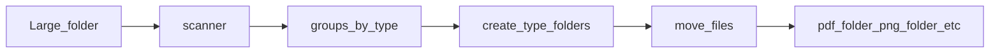

# Autosort

You have one big folder full of mixed files — PDFs, Word documents, PNGs, JPEGs, and everything else. You want them sorted into type folders **inside that same folder**: `pdf_folder`, `word_folder`, `png_folder`, and so on.

No AI. No cloud required for the basics. Just an algorithm that detects file types and moves files where they belong.

Autosort also ships as a **learning-friendly SaaS template**: pay-as-you-go billing, GitHub identity (no password accounts), API keys, and a hybrid model where sorting can run **on your machine** or **in the cloud**.

## The problem (why this exists)

```
Input:  one large folder with many files at the top level (subfolders ignored)
Output: the same folder, now containing pdf_folder/, word_folder/, png_folder/, ...
```

That is the whole product. Everything else — the API, Stripe, the web UI — exists to show how you can wrap a small algorithm in a real SaaS without building login forms or monthly subscriptions.

## How it works (four steps)

| Step | What happens | Code |
|------|----------------|------|
| 1 | Walk the folder, group absolute paths by file type | [`packages/core/scanner.py`](packages/core/scanner.py) |
| 2 | Create `<type>_folder` for each type found | [`packages/core/folders.py`](packages/core/folders.py) |
| 3 | Move each file into its type folder | [`packages/core/mover.py`](packages/core/mover.py) |
| 4 | Pick a folder in the UI (or CLI) and review sort history | [`packages/web/app/sort/`](packages/web/app/sort/), [`packages/api/routers/history.py`](packages/api/routers/history.py) |

Type detection uses **file extension + magic bytes** — deterministic, testable, free. See [`packages/core/detector.py`](packages/core/detector.py).



## Quick start (local only)

No account, no API, no internet:

```bash
pip install -e ".[dev]"
pytest packages/core/tests
autosort sort ./my_folder --dry-run   # preview
autosort sort ./my_folder             # move files
```

## Quick start (SaaS stack)

No password accounts. Identity via **GitHub OAuth** + **API key** + **Stripe** (billed per file sorted).

```bash
# Terminal 1 — API
uvicorn api.main:app --reload --port 8000

# Terminal 2 — Web
cd packages/web && npm install && npm run dev
```

1. Open http://localhost:3000/connect — connect GitHub, add payment method, get API key  
2. **Cloud:** http://localhost:3000/sort — upload a zip of your files  
3. **Local:** `autosort sort ./folder --api-key sk_...`  
4. **History:** http://localhost:3000/history  
5. **API docs:** http://localhost:8000/docs  

Copy [`.env.example`](.env.example) to `.env`. See [docs/ENVIRONMENT.md](docs/ENVIRONMENT.md) for GitHub and Stripe setup.

## Docker

```bash
docker compose up --build
```

## Hybrid modes

| Mode | Where files are sorted | You pay when |
|------|------------------------|--------------|
| **Local** | Your disk (CLI) | Job completes and reports file count |
| **Cloud** | Server (zip upload) | Sort finishes on server |

Same API key. Same per-file meter. Different place the algorithm runs.

## Packages

| Package | Role | Docs |
|---------|------|------|
| [`packages/core`](packages/core/README.md) | Sorting algorithm | Pipeline: scan → folders → move |
| [`packages/cli`](packages/cli/README.md) | Local agent | `autosort sort` |
| [`packages/api`](packages/api/README.md) | FastAPI + OpenAPI | Jobs, billing, OAuth |
| [`packages/web`](packages/web/README.md) | Next.js UI | Connect, sort, history |

Full architecture: [docs/ARCHITECTURE.md](docs/ARCHITECTURE.md)

## Reuse this SaaS pattern in any project

The sorting logic is interchangeable. The **pattern** is what you can copy into Express, Django, Rails, Go, or anything else:

| Layer | Autosort choice | Your project |
|-------|-----------------|--------------|
| **Identity** | GitHub OAuth → store `github_id` | Any OAuth provider; no email/password DB |
| **Access** | API keys (`Bearer sk_...`) | Same idea in any framework |
| **Billing** | Stripe metered (1 file = 1 unit) | Stripe, Paddle, or custom ledger |
| **Execution** | Core runs locally **or** on server | Your business logic, same split |
| **Audit** | Job history API | Replace with your domain events |

**Onboarding (once):** OAuth → add card → receive API key.  
**Runtime (every request):** API key only — CLI and scripts never open a browser.

| Concept | Python (here) | Node.js | Go | Ruby |
|---------|---------------|---------|-----|------|
| HTTP API | FastAPI | Express / NestJS | Gin | Rails API |
| OAuth | GitHub + httpx | Passport | oauth2 package | OmniAuth |
| Metered billing | Stripe Meter Events | stripe-node | stripe-go | stripe-ruby |

Read the full portable blueprint: **[docs/SAAS_PATTERN.md](docs/SAAS_PATTERN.md)**

## Contributing

See [CONTRIBUTING.md](CONTRIBUTING.md). Module comment template: [docs/MODULE_DOC_TEMPLATE.md](docs/MODULE_DOC_TEMPLATE.md).

## License

[MIT](LICENSE)
