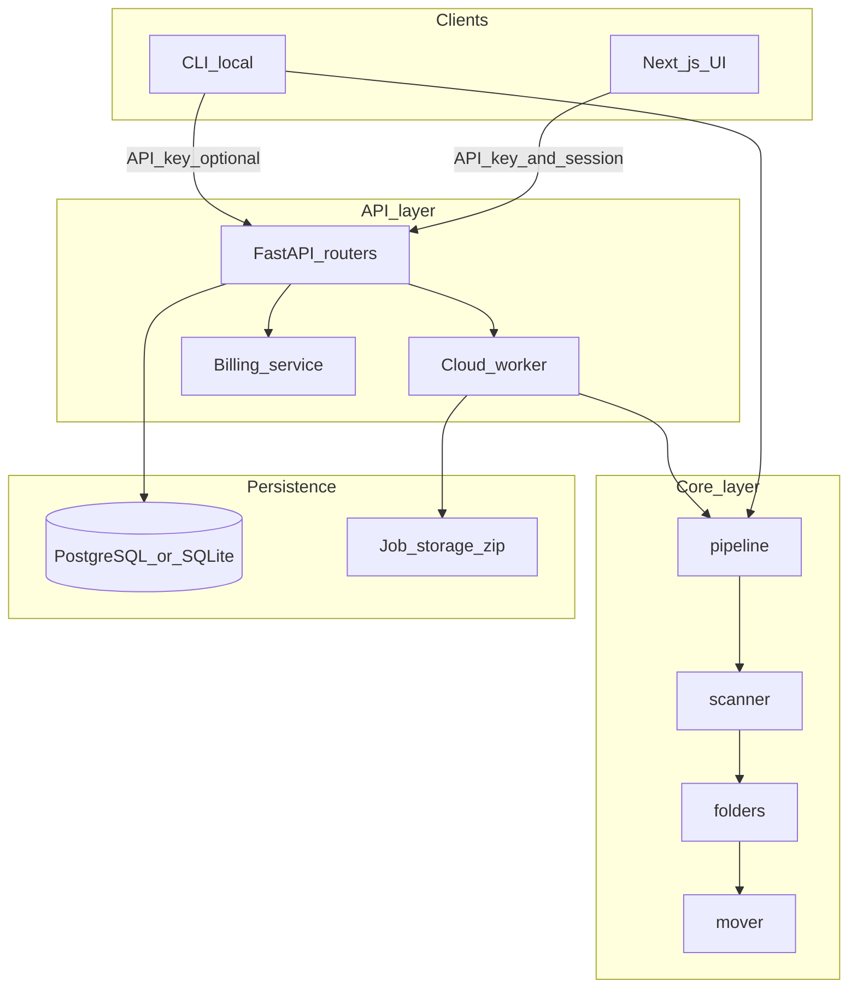
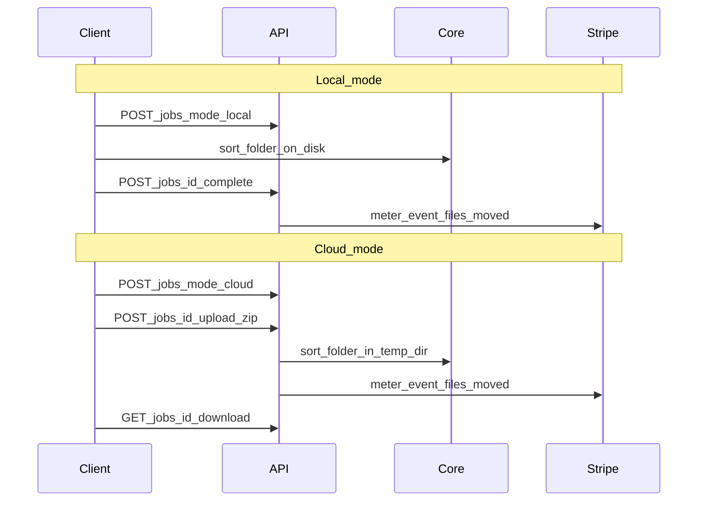

# Architecture

Autosort is a monorepo with four packages. The sorting algorithm has no network dependencies; SaaS layers wrap it.



## Package boundaries

| Package | Responsibility | Depends on |
|---------|----------------|------------|
| `packages/core` | Detect type, scan, create folders, move files | stdlib only |
| `packages/cli` | Run `sort_folder` on local disk; optional API reporting | `core`, HTTP client |
| `packages/api` | REST API, OAuth, API keys, jobs, billing, cloud sort | `core`, SQLAlchemy, Stripe |
| `packages/web` | Connect, sort upload, history UI | HTTP to API |

**Rule:** `core` never imports `api` or `web`.

## README four-step mapping

| Step | Module | File |
|------|--------|------|
| 1 — Scan and group by type | `scan_folder` input | `packages/core/scanner.py` |
| 2 — Create `<type>_folder` | folder creator | `packages/core/folders.py` |
| 3 — Move files | mover | `packages/core/mover.py` |
| 4 — UI + history | web + audit API | `packages/web/app/sort/`, `packages/api/routers/history.py` |

`packages/core/pipeline.py` chains steps 1–3.

## Job lifecycle



### Job statuses

| Status | Meaning |
|--------|---------|
| `pending` | Created, waiting for upload (cloud) or CLI completion (local) |
| `processing` | Cloud zip received, sort in progress |
| `done` | Finished; history and billing updated |
| `failed` | Error during cloud processing |

## API routers

| Router | Prefix | Auth |
|--------|--------|------|
| `github.py` | `/auth` | Public redirect; callback sets session cookie |
| `api_keys.py` | `/api-keys` | GitHub session |
| `billing.py` | `/billing` | GitHub session |
| `jobs.py` | `/jobs` | API key |
| `upload.py` | `/jobs/{id}/upload` | API key |
| `history.py` | `/history` | API key |

OpenAPI: `http://localhost:8000/docs`

## Cloud storage layout

Per job ID under `STORAGE_PATH`:

```
{job_id}/
  upload.zip      # incoming archive
  input/          # extracted files
  output.zip      # sorted result
```

See `packages/api/services/storage.py`.
