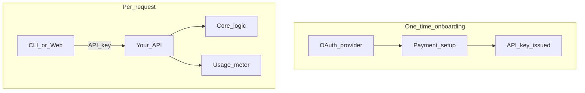

# Portable pay-as-you-go SaaS pattern

This guide explains how to reuse Autosort's SaaS model in **any language or framework**. The product logic (sorting files) is separate from the billing and identity layer — you can swap the core while keeping the same pattern.

## Problem this pattern solves

Many tools need:

- A way to identify users **without** building login forms, password resets, and email verification
- **Usage-based billing** instead of monthly subscriptions
- **Two execution modes**: work on the user's machine (local agent) or on your server (cloud)
- An **audit trail** of what was processed

Autosort implements this with GitHub OAuth, API keys, Stripe metered billing, and a job history API.

## Minimal data model

| Entity | Fields | Purpose |
|--------|--------|---------|
| **Identity** | `oauth_provider_id`, `username`, `payment_customer_id` | Who the user is (no password) |
| **ApiKey** | `key_hash`, `identity_id`, `prefix` | Long-lived access for CLI/automation |
| **Job** | `mode`, `status`, `files_processed`, `result_json` | One sort operation + audit log |
| **Usage counter** | `files_billed_this_month` | Local cache; sync to meter on each job |

Store API keys as **hashes** only. Show the raw key once at creation.

## Auth split (important)

| Phase | Mechanism | Used for |
|-------|-----------|----------|
| Onboarding | OAuth session cookie | Connect identity, add card, create API key |
| Runtime | `Authorization: Bearer sk_...` | Create jobs, upload, history, download |

Do not require OAuth on every API call. CLI and scripts cannot open a browser.

## Billing: pay per unit

1. User adds a payment method once (Stripe Setup Checkout or equivalent).
2. After work completes, call your meter: **1 file sorted = 1 usage unit**.
3. Provider invoices at month end.

| Mode | When to report usage |
|------|----------------------|
| Local agent | Client runs core logic, then `POST /jobs/{id}/complete` with `files_moved` |
| Cloud | Server runs core logic, then reports before returning download |

In Autosort: `packages/api/services/billing_service.py` → `stripe.billing.MeterEvent.create`.

## Security checklist

- Hash API keys (SHA-256); never log raw keys
- HTTPS in production
- CORS: allow only your web origin; `credentials: true` for session cookie
- Validate API key + payment method before creating jobs
- Rate-limit job creation per identity
- Expire OAuth session cookies; rotate `SESSION_SECRET`

## Porting table (same concepts, different stacks)

| Concept | Autosort (this repo) | Node / Express | Go / Gin | Ruby / Rails | Django |
|---------|----------------------|----------------|----------|--------------|--------|
| HTTP API | FastAPI | Express, NestJS | Gin, Echo | Rails API | DRF |
| OAuth | GitHub OAuth | Passport.js | golang.org/x/oauth2 | OmniAuth | social-auth |
| API keys | Custom middleware | Custom middleware | Middleware | `has_secure_token` pattern | Custom header auth |
| Jobs DB | SQLAlchemy + PostgreSQL | Prisma, TypeORM | GORM | ActiveRecord | Django ORM |
| Metered billing | Stripe Meter Events | Stripe Node SDK | stripe-go | stripe-ruby | stripe Python |
| Local agent | Python CLI | Node CLI, Go binary | Same | Same | Same |
| OpenAPI docs | `/docs` auto | swagger-jsdoc | swaggo | rswag | drf-spectacular |

## What to copy vs replace

**Copy the pattern:**

- Identity + ApiKey + Job tables
- Onboarding flow: OAuth → payment → API key
- Job lifecycle: `pending` → `processing` → `done` / `failed`
- Usage report **after** work completes
- Separate `core` package/module with zero HTTP dependencies

**Replace per project:**

- OAuth provider (GitHub, Google, GitLab, …)
- Payment provider (Stripe, Paddle, Lemon Squeezy, …)
- Core business logic (file sort, image resize, PDF merge, …)
- Storage (local disk, S3, R2) for cloud mode uploads

## Hybrid local + cloud

| | Local | Cloud |
|---|-------|-------|
| Where core runs | User's machine | Your server |
| Files leave user disk? | No | Yes (zip upload) |
| API role | Auth, billing, audit log | Auth, billing, sort, storage |
| Best for | Large folders, privacy | No install, shareable link |

Both modes use the same API key and the same usage meter.

## Reference implementation in this repo

| Piece | Path |
|-------|------|
| Core algorithm | `packages/core/` |
| Local CLI | `packages/cli/main.py` |
| API + billing | `packages/api/` |
| Onboarding UI | `packages/web/app/connect/` |
| Usage reporting | `packages/api/services/billing_service.py` |

Read [ARCHITECTURE.md](ARCHITECTURE.md) for package boundaries and [ENVIRONMENT.md](ENVIRONMENT.md) for configuration.
