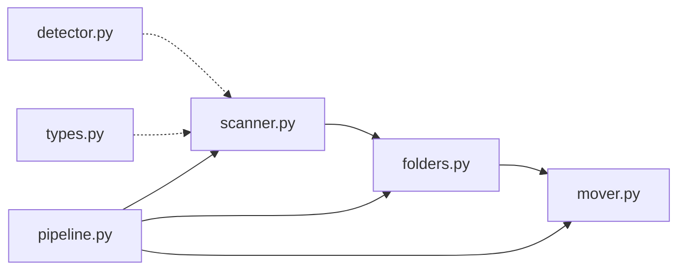

# packages/core

Sorting algorithm — README steps 1–3.



| File | Responsibility | Depends on |
|------|----------------|------------|
| `types.py` | Shared data structures | — |
| `detector.py` | File type detection (extension + magic bytes) | — |
| `scanner.py` | Step 1: scan folder, build sort matrix | `detector`, `types` |
| `folders.py` | Step 2: create `<type>_folder` directories | `types` |
| `mover.py` | Step 3: move files into type folders | `folders`, `types` |
| `pipeline.py` | Orchestrates scan → folders → move | all above |

## Run tests

```bash
pytest packages/core/tests
```

## Usage from Python

```python
from pathlib import Path
from core.pipeline import sort_folder

result = sort_folder(Path("./my_folder"), dry_run=False)
print(result.files_moved, result.types_found)
```
